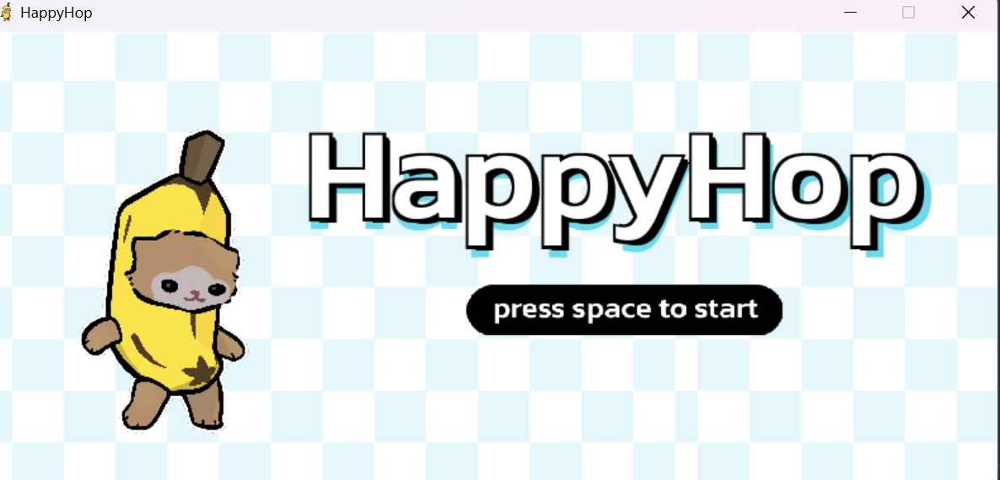
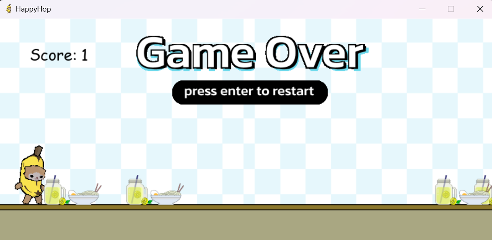
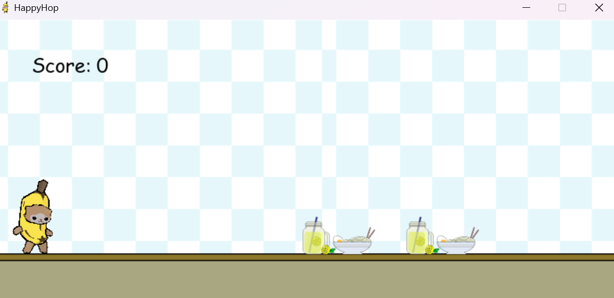

# HappyHop

HappyHop is a simple endless runner game built with Pygame, a cat on a quest to achieve the maximum score by avoiding obstacles.

## Features

- **Endless Running:** The game offers an endless runner experience, challenging players to see how far they can go.
- **Obstacle Avoidance:** Dodge obstacles like pot , juice and others to stay alive and maintain a high score.
- **Score System:** Dodge obstacles to increase your score. Challenge yourself and friends to beat the high score.

## Screenshots






## How to Play

1. **Controls:**
   - Use the **Left Arrow** or **a** key to move the cat left.
   - Use the **Right Arrow** or **d** key to move the cat right.
   - Press the **Spacebar** or **w** to make the cat jump.

2. **Objective:**
   - Avoid obstacles to prevent game over and increase the score.

3. **Game Over:**
   - The game ends when the cat collides with an obstacle.
   - Press **Enter/Return** to return to the main menu after a game over.

## Installation

1. Clone the repository:

    ```bash
    git clone https://github.com/042Vidhi/HappyHop.git
    ```

2. Install dependencies:

    ```bash
    pip install pygame
    ```

3. Run the game:

    ```bash
    python main.py
    ```

Enjoy playing Banana Cat Runner! :)
